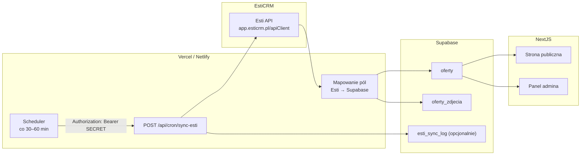

# Plan integracji EstiCRM → Supabase

Dokument opisuje szczegółową checklistę wdrożenia automatycznej synchronizacji ofert z EstiCRM do bazy Supabase oraz powiązane zmiany w panelu administracyjnym i obsłudze zdjęć.

**Status:** plan do zatwierdzenia — bez implementacji kodu.

---

## 1. Cel i zakres

### Cel biznesowy
Oferty dodawane lub edytowane w EstiCRM mają automatycznie pojawiać się na stronie (Supabase → Next.js). Gdy oferta znika z aktywnej listy w Esti, ma być **ukryta na stronie**, ale **nie usuwana z bazy** — trwałe usunięcie tylko ręcznie z panelu admina.

### Zakres techniczny
| W zakresie | Poza zakresem (na ten etap) |
|---|---|
| Pobieranie aktywnych ofert z Esti API | Eksport XML/FTP z Esti |
| Upsert do tabeli `oferty` po `esti_id` | Dwukierunkowa synchronizacja (strona → Esti) |
| Sync zdjęć z Esti jako linki URL | Pobieranie zdjęć Esti do Supabase Storage |
| Ukrywanie ofert znikniętych z Esti | Automatyczne kasowanie rekordów z bazy |
| Zakładka ofert ukrytych w panelu | Edycja pól zarządzanych wyłącznie w Esti (np. cena) z poziomu strony |
| Ręczne oferty (`zrodlo = strona`) — bez dotykania | Migracja historycznych danych spoza Esti |
| Dodatkowe zdjęcia: upload pliku **lub** wklejenie URL | Integracja agentów Esti na stronie kontaktowej |

---

## 2. Ustalenia biznesowe (zatwierdzone)

| Temat | Decyzja |
|---|---|
| **Które oferty synchronizować** | Wszystkie **aktywne** oferty z Esti (nie tylko `/offer/exported-list`) |
| **Oferta znika z Esti** | Ustawić `status = ukryta` — znika ze strony publicznej, rekord zostaje w bazie |
| **Usunięcie z bazy** | Tylko ręcznie z panelu admina (istniejący flow z potwierdzeniem tytułu) |
| **Oferty ręczne (`zrodlo = strona`)** | Sync **nigdy** ich nie modyfikuje ani nie ukrywa |
| **`wyrozniona` / `wyrozniona_na_stronie_glownej`** | Tylko ręcznie w panelu — sync **nie nadpisuje** tych pól |
| **Zdjęcia z Esti** | Przechowywane jako **linki URL** (bez uploadu do Storage) |
| **Dodatkowe zdjęcia na stronie** | Upload pliku (jak teraz) **+** możliwość wklejenia URL zamiast pliku |
| **Hosting docelowy** | Netlify |
| **Hosting testowy (teraz)** | Vercel |

---

## 3. Stan obecny projektu (punkt wyjścia)

Baza i aplikacja są już częściowo przygotowane:

- Tabela `oferty` ma pola: `zrodlo`, `esti_id`, `ostatnio_widziana_w_esti`
- Unikalny indeks `oferty_esti_id_key` na `esti_id` (zapobiega duplikatom przy imporcie)
- Panel admina: CRUD ofert, upload zdjęć do bucketa `oferty-zdjecia`
- Strona publiczna filtruje `status <> 'ukryta'`
- **Brak** kodu klienta Esti API, endpointu sync i crona

### Pliki, które zostaną rozszerzone / dodane

```
src/lib/esti/                    # NOWY — klient API, mapowanie, sync
src/app/api/cron/sync-esti/      # NOWY — endpoint synchronizacji
src/app/api/admin/images/        # ROZSZERZENIE — dodanie zdjęcia po URL
src/app/panel-admin/             # ROZSZERZENIE — zakładki, sync status, formularz zdjęć
supabase/migrations/             # NOWA migracja — źródło zdjęć, opcjonalne pola sync
.env.example                     # NOWE zmienne Esti + cron secret
vercel.json                      # Cron na Vercel (test)
netlify.toml                     # Scheduled function na Netlify (prod)
```

---

## 4. Architektura synchronizacji



### Model synchronizacji
Esti **nie ma webhooków** — sync opiera się na **pollingu** (cyklicznym odpytywaniu API).

Dwa tryby pracy:
1. **Pełny sync** (pierwsze uruchomienie / recovery) — pobranie wszystkich aktywnych ofert
2. **Przyrostowy sync** (codzienna praca) — `updateDate` od ostatniego udanego syncu + pełna reconciliacja ID (wykrywanie znikniętych ofert)

---

## 5. Esti API — endpointy i parametry

**Base URL:** `https://app.esticrm.pl/apiClient`

**Autoryzacja (każde żądanie):**
- `company` — ID firmy (env: `ESTI_COMPANY_ID`)
- `token` — hash API (env: `ESTI_API_TOKEN`)

> ⚠️ **Bezpieczeństwo:** dane API nigdy nie trafiają do repozytorium. Przechowywać wyłącznie w zmiennych środowiskowych (Vercel / Netlify). Po udostępnieniu tokenu w czacie zalecana jest **rotacja tokenu** w panelu Esti.

### Endpointy do użycia

| Endpoint | Cel | Kiedy |
|---|---|---|
| `GET /offer/list` | Pełne dane ofert (paginacja `skip`/`take`) | Główny import / update |
| `GET /offer/basic-list` | Lekka lista ID + `update_date` | Szybka reconciliacja / wykrywanie zmian |
| `GET /offer/details?id={id}` | Szczegóły pojedynczej oferty | Gdy potrzeba pełnych danych poza listą |
| `GET /offer/dictionary` | Słowniki (waluty, statusy, typy…) | Jednorazowo przy starcie + cache |
| `GET /offer/mapping` | Mapowanie nazw pól → słowniki | Jednorazowo przy starcie + cache |

**Parametr `status` dla aktywnych ofert** (wg dokumentacji EstiAPI v1.5):
- `3` — aktywna, publikowana
- `99` — dostępna wewnętrzna

→ Zapytanie: `status=3,99`

**Parametr `updateDate`** (opcjonalny, format `YYYY-MM-DD HH:MM:SS`):
- Używany w sync przyrostowym do pobrania tylko zmienionych ofert

### Endpointy NIEużywane w tym etapie
- `/offer/exported-list` — user wybrał sync wszystkich aktywnych, nie tylko eksportowanych na WWW
- `/offer/store`, `/offer/send-picture` — zapis do Esti (poza zakresem)
- Eksport XML/FTP — alternatywa odrzucona na ten etap

---

## 6. Mapowanie pól Esti → Supabase

### 6.1 Tabela `oferty`

| Kolumna Supabase | Źródło Esti (przykład) | Uwagi |
|---|---|---|
| `esti_id` | `id` (number → string) | Klucz synchronizacji |
| `zrodlo` | stałe `'esti'` | Dla nowych rekordów z importu |
| `tytul` | generowany lub z pól lokalizacji + typ | Do ustalenia po pierwszym teście API — może wymagać szablonu |
| `opis` | `description` | HTML — sprawdzić czy renderować jako HTML czy strip |
| `status` | `status` (numeryczny) | Mapowanie poniżej |
| `typ_nieruchomosci` | `mainTypeId` / `type_id` | Mapowanie słownikowe |
| `typ_transakcji` | `transaction` | `131` → sprzedaż, `132` → wynajem |
| `rynek` | `market` | `10` → pierwotny, `11` → wtórny |
| `cena` | `price` | numeric |
| `waluta` | `priceCurrency` → słownik | domyślnie PLN |
| `cena_za_m2` | `pricePermeter` | |
| `powierzchnia` | `area_total` / odpowiednik z listy | |
| `powierzchnia_uzytkowa` | `area_usable` | |
| `powierzchnia_dzialki` | pole działki | jeśli dostępne |
| `liczba_pokoi` | `apartment_room_number` / `room_number` | |
| `pietro` | `apartment_floor` / `floor_number` | |
| `liczba_pieter_w_budynku` | `building_floornumber` | |
| `rok_budowy` | `building_year` | |
| `miasto` | z tokena lokalizacji / pól location | Wymaga parsowania odpowiedzi API |
| `dzielnica` | j.w. | |
| `ulica` | `location_street` + numer | |
| `kod_pocztowy` | `locationPostal` | |
| `szerokosc_geo` | `locationLatitude` | |
| `dlugosc_geo` | `locationLongitude` | |
| `agent_id` | `user_id` / opiekun oferty | opcjonalnie |
| `slug` | generowany przez `buildOfferSlug()` | Istniejąca funkcja w `src/lib/offers.ts` |
| `seo_tytul` / `seo_opis` | auto przez `applyGeneratedSeo()` | Istniejąca logika — tylko przy tworzeniu lub gdy puste |
| `ostatnio_widziana_w_esti` | `update_date` z Esti / `now()` | Aktualizowane przy każdym syncu |
| `wyrozniona` | — | **Nie nadpisywać** przy update |
| `wyrozniona_na_stronie_glownej` | — | **Nie nadpisywać** przy update |

### 6.2 Mapowanie statusów Esti → enum `oferta_status`

| Status Esti | Znaczenie (wg dokumentacji) | Status Supabase |
|---|---|---|
| `3` | Aktywna, publikowana | `aktywna` |
| `99` | Dostępna wewnętrzna | `aktywna` |
| `4` | Rezerwacja | `rezerwacja` |
| `7` | Sprzedana | `sprzedana` |
| `9` | Wycofana | `ukryta` |
| inne / archiwalne | — | `ukryta` (bezpieczny fallback) |

**Oferta znika z listy aktywnych w Esti** (nie wraca w reconciliacji):
→ `status = ukryta` (tylko gdy `zrodlo = 'esti'`)

### 6.3 Mapowanie typów nieruchomości Esti → enum

| Esti `type_id` / `mainTypeId` | Supabase `typ_nieruchomosci` |
|---|---|
| `1` | `dom` |
| `2` | `mieszkanie` |
| `3` | `dzialka` |
| `4` | `lokal_komercyjny` |
| `7` | `biuro` |
| `8` | `lokal_komercyjny` (lub osobna kategoria — do weryfikacji) |
| `9` | `hala` |
| nieznany | log warning + fallback `mieszkanie` lub pominięcie oferty |

> Dokładne mapowanie zweryfikować na żywych danych firmy (krok 0 — discovery).

### 6.4 Tabela `oferty_zdjecia`

| Kolumna | Wartość dla zdjęć Esti | Wartość dla zdjęć ręcznych (upload) | Wartość dla URL ręcznego |
|---|---|---|---|
| `url` | URL z Esti | public URL z Storage | wklejony URL |
| `sciezka` | `''` lub prefiks `esti:` | ścieżka w bucketcie | `''` lub prefiks `external:` |
| `kolejnosc` | kolejność z Esti | jak teraz | jak teraz |
| `czy_glowne` | pierwsze z Esti = główne | pierwsze upload = główne | do ustalenia przez admina |
| `zrodlo` *(nowa kolumna)* | `esti` | `upload` | `url` |

**Reguły merge zdjęć przy sync:**
1. Zdjęcia z `zrodlo = 'esti'` — **zastępowane** przy każdym syncu (odzwierciedlają aktualny stan Esti)
2. Zdjęcia z `zrodlo IN ('upload', 'url')` — **nigdy nie usuwane** przez sync
3. Przy usuwaniu zdjęcia upload — jak teraz: kasowanie z Storage tylko gdy `sciezka` wskazuje na bucket
4. Przy usuwaniu zdjęcia Esti — tylko rekord w DB (bez Storage)

---

## 7. Zmiany w bazie danych (migracja)

### 7.1 Nowa kolumna w `oferty_zdjecia`

```sql
-- Propozycja
create type oferta_zdjecie_zrodlo as enum ('esti', 'upload', 'url');

alter table public.oferty_zdjecia
  add column if not exists zrodlo oferta_zdjecie_zrodlo not null default 'upload';

-- sciezka nie powinna być wymagana dla linków zewnętrznych
alter table public.oferty_zdjecia
  alter column sciezka drop not null;
```

### 7.2 Opcjonalna tabela logów sync (zalecana)

```sql
create table public.esti_sync_log (
  id            uuid primary key default gen_random_uuid(),
  started_at    timestamptz not null default now(),
  finished_at   timestamptz,
  success       boolean,
  mode          text not null, -- 'full' | 'incremental'
  added         int default 0,
  updated       int default 0,
  hidden        int default 0,
  errors        int default 0,
  error_message text,
  details       jsonb
);
```

### 7.3 Opcjonalna tabela stanu sync (dla `updateDate`)

```sql
create table public.esti_sync_state (
  id                    int primary key default 1 check (id = 1),
  last_successful_sync  timestamptz,
  last_update_date_used text -- format Esti
);
```

### 7.4 Indeksy

```sql
create index if not exists oferty_zdjecia_zrodlo_idx
  on public.oferty_zdjecia (oferta_id, zrodlo);
```

---

## 8. Zmienne środowiskowe

Dodać do `.env.example` (bez prawdziwych wartości):

```env
# EstiCRM API
ESTI_COMPANY_ID=
ESTI_API_TOKEN=
ESTI_API_BASE_URL=https://app.esticrm.pl/apiClient

# Zabezpieczenie endpointu cron
CRON_SECRET=losowy-dlugi-ciag-znakow

# Opcjonalnie
ESTI_SYNC_STATUS_FILTER=3,99
ESTI_SYNC_BATCH_SIZE=50
```

Ustawić identyczne zmienne w:
- [ ] Vercel (środowisko testowe)
- [ ] Netlify (produkcja)
- [ ] Lokalnie w `.env.local` (dev — ręczne wywołanie sync)

---

## 9. Checklista implementacji — fazy

### Faza 0 — Discovery i weryfikacja API
- [ ] Utworzyć skrypt testowy (jednorazowy) wywołujący Esti API z credentials z env
- [ ] Pobrać `/offer/dictionary` i `/offer/mapping` — zapisać snapshot do pliku dev (gitignored)
- [ ] Pobrać `GET /offer/list?status=3,99&skip=0&take=5` — przeanalizować strukturę odpowiedzi
- [ ] Sprawdzić format zdjęć w odpowiedzi (tablica URL? osobne pole?)
- [ ] Sprawdzić format tytułu — czy Esti zwraca gotowy tytuł czy trzeba go składać
- [ ] Sprawdzić format opisu (plain text vs HTML)
- [ ] Zweryfikować mapowanie typów nieruchomości na realnych ofertach firmy
- [ ] Oszacować liczbę aktywnych ofert (wpływ na czas sync i limity hostingu)
- [ ] Potwierdzić, że credentials mają uprawnienia administratora (wymagane przez Esti)

**Kryterium ukończenia:** dokument z przykładową odpowiedzią API i zatwierdzonym mapowaniem pól.

---

### Faza 1 — Klient Esti API (`src/lib/esti/`)

- [ ] `client.ts` — wrapper HTTP (fetch) z `company` + `token`, timeout, retry (max 2)
- [ ] `types.ts` — typy TypeScript dla odpowiedzi Esti (na podstawie discovery)
- [ ] `dictionary.ts` — pobieranie i cache słowników (in-memory na czas jednego sync)
- [ ] `offers.ts` — metody:
  - [ ] `fetchActiveOffersList({ skip, take, updateDate? })`
  - [ ] `fetchActiveOffersBasicList({ updateDate? })`
  - [ ] `fetchOfferDetails(id)`
- [ ] `errors.ts` — klasy błędów (auth, rate limit, parse)
- [ ] Testy manualne / skrypt CLI: `npm run esti:ping` (opcjonalnie)

**Kryterium ukończenia:** stabilne pobranie listy aktywnych ofert z paginacją.

---

### Faza 2 — Mapowanie Esti → Supabase (`src/lib/esti/map-offer.ts`)

- [ ] Funkcja `mapEstiOfferToSupabase(estiOffer, dictionary): OfertaInsert`
- [ ] Funkcja `mapEstiStatus(status: number): OfertaStatus`
- [ ] Funkcja `mapEstiType(typeId: number): OfertaTypNieruchomosci`
- [ ] Funkcja `mapEstiPhotos(estiOffer): Array<{ url, kolejnosc }>`
- [ ] Funkcja `buildTitleFromEsti(estiOffer): string` — jeśli brak gotowego tytułu
- [ ] Generowanie `slug` przez istniejące `buildOfferSlug()`
- [ ] Generowanie SEO przez istniejące `applyGeneratedSeo()` — tylko dla nowych ofert

**Kryterium ukończenia:** unit-testy mapowania na fixture z Fazy 0.

---

### Faza 3 — Silnik synchronizacji (`src/lib/esti/sync.ts`)

#### 3.1 Algorytm pełnego sync (pierwsze uruchomienie)

```
1. Pobierz wszystkie aktywne oferty z Esti (paginacja skip/take)
2. Zbierz zestaw esti_id z odpowiedzi → activeEstiIds
3. Dla każdej oferty:
   a. mapuj pola
   b. UPSERT do oferty WHERE esti_id = X
      - INSERT: ustaw zrodlo='esti', wyrozniona=false, wyrozniona_na_stronie_glownej=false
      - UPDATE: nadpisz pola z Esti, ZACHOWAJ wyrozniona*
   c. Zastąp zdjęcia zrodlo='esti' nową listą z Esti
   d. Ustaw ostatnio_widziana_w_esti = now()
4. Reconciliacja — ukryj zniknięte:
   SELECT * FROM oferty WHERE zrodlo='esti' AND esti_id NOT IN activeEstiIds
   → UPDATE status='ukryta'
5. Zapisz log sync
```

#### 3.2 Algorytm sync przyrostowego (codzienny)

```
1. Odczytaj last_successful_sync z esti_sync_state
2. Pobierz oferty z updateDate >= last_sync (basic-list lub list)
3. Dla zmienionych — upsert jak wyżej
4. Pełna reconciliacja ID (basic-list wszystkich aktywnych) — wykrycie usuniętych
5. Zaktualizuj esti_sync_state
```

#### 3.3 Zasady ochrony danych ręcznych

- [ ] Sync **pomija** rekordy `zrodlo = 'strona'`
- [ ] Przy UPDATE oferty Esti **nie zmienia** `wyrozniona`, `wyrozniona_na_stronie_glownej`
- [ ] Przy UPDATE **nie zmienia** `seo_tytul` / `seo_opis` jeśli admin je ręcznie edytował
  - Opcja: dodać flagę `seo_reczne` lub sprawdzać czy SEO różni się od auto-wygenerowanego
- [ ] Zdjęcia `upload` / `url` **nie są usuwane** przez sync

#### 3.4 Obsługa błędów

- [ ] Pojedynczy błąd oferty nie przerywa całego sync (log + `errors++`)
- [ ] Błąd autoryzacji Esti → sync fail, alert w logu
- [ ] Timeout całego sync → Netlify/Vercel ma limit czasu funkcji (sprawdzić plan)

**Kryterium ukończenia:** dry-run na środowisku testowym z 5–10 ofertami.

---

### Faza 4 — Endpoint cron (`src/app/api/cron/sync-esti/route.ts`)

- [ ] `POST` (lub `GET` zgodnie z wymaganiami platformy)
- [ ] Weryfikacja nagłówka `Authorization: Bearer ${CRON_SECRET}`
- [ ] Parametr query `?mode=full|incremental` (domyślnie incremental)
- [ ] Odpowiedź JSON: `{ ok, added, updated, hidden, errors, durationMs }`
- [ ] Blokada równoległych sync (lock w DB lub flaga in-memory z TTL)
- [ ] Maksymalny czas wykonania — log ostrzeżenia jeśli > 50s (limit Netlify)

**Kryterium ukończenia:** ręczne wywołanie curl z CRON_SECRET zwraca poprawny wynik.

---

### Faza 5 — Harmonogram (cron)

#### Vercel (test — teraz)

- [ ] Dodać `vercel.json`:

```json
{
  "crons": [
    {
      "path": "/api/cron/sync-esti",
      "schedule": "0 * * * *"
    }
  ]
}
```

- [ ] Ustawić `CRON_SECRET` w Vercel env
- [ ] Vercel Cron wysyła request z nagłówkiem `Authorization` — zweryfikować format w docs Vercel dla Next.js 16
- [ ] Alternatywa: zewnętrzny cron (cron-job.org) wywołujący endpoint z Bearer token

#### Netlify (produkcja)

- [ ] Skonfigurować **Scheduled Function** lub zewnętrzny cron (Netlify nie ma natywnego crona jak Vercel — opcje):
  1. **Netlify Scheduled Functions** (jeśli dostępne w planie)
  2. **Zewnętrzny serwis cron** (cron-job.org, EasyCron) → `POST https://domena.pl/api/cron/sync-esti`
  3. **Supabase pg_cron + Edge Function** jako alternatywa
- [ ] Ustawić interwał: **co 30–60 minut** (Esti sam eksportuje co godzinę przy XML — API można częściej)
- [ ] Pierwszy pełny sync (`mode=full`) ręcznie po deploy

**Kryterium ukończenia:** sync uruchamia się automatycznie bez interwencji.

---

### Faza 6 — Panel administracyjny

#### 6.1 Zakładki w `AdminDashboard`

- [ ] **Aktywne** — oferty ze `status <> 'ukryta'` (domyślna)
- [ ] **Ukryte** — oferty ze `status = 'ukryta'`
  - Badge: „Z Esti” / „Ręczna” (`zrodlo`)
  - Badge: „Usunięta z Esti” gdy `zrodlo='esti'` i `ostatnio_widziana_w_esti` starsze niż ostatni sync
- [ ] **Wszystkie** — opcjonalnie, dla pełnego widoku

#### 6.2 Filtry dodatkowe

- [ ] Filtr po `zrodlo`: Esti / Strona / Wszystkie
- [ ] Istniejący filtr kategorii i wyszukiwarka — działają w każdej zakładce

#### 6.3 Status synchronizacji

- [ ] Pasek informacyjny: „Ostatni sync: {data}, dodano X, zaktualizowano Y, ukryto Z”
- [ ] Przycisk **„Synchronizuj teraz”** (wywołuje endpoint admina, nie crona — wymaga zalogowania)
- [ ] Endpoint `POST /api/admin/sync-esti` — wrapper na ten sam silnik co cron

#### 6.4 Formularz oferty (`OfferForm`)

- [ ] Dla ofert `zrodlo = 'esti'`:
  - [ ] Pola z Esti **readonly** (tytuł, cena, opis, lokalizacja…) lub wyraźna informacja „Edytuj w EstiCRM”
  - [ ] Pola lokalne **edytowalne**: `wyrozniona`, `wyrozniona_na_stronie_glownej`, SEO (opcjonalnie)
  - [ ] Sekcja zdjęć: rozróżnienie Esti / upload / URL (ikona źródła)
  - [ ] Blokada usuwania zdjęć Esti z poziomu panelu (opcjonalnie — lub pozwolić, ale sync je przywróci)

- [ ] Dla ofert `zrodlo = 'strona'`:
  - [ ] Bez zmian — pełna edycja jak teraz

#### 6.5 Usuwanie ofert

- [ ] Istniejący flow usuwania (potwierdzenie tytułu) — bez zmian
- [ ] W zakładce Ukryte — wyraźny przycisk „Usuń trwale”
- [ ] Przy usuwaniu oferty Esti — kasować też zdjęcia upload ze Storage, linki Esti/URL tylko z DB

**Kryterium ukończenia:** admin widzi ukryte oferty, może je trwale usunąć, ręcznie wyróżnić ofertę z Esti.

---

### Faza 7 — Rozszerzenie obsługi zdjęć

#### 7.1 Nowy endpoint: dodanie zdjęcia po URL

- [ ] `POST /api/admin/images` z body `{ offerId, url }`
- [ ] Walidacja URL (https, rozszerzenie obrazu lub HEAD request)
- [ ] Insert do `oferty_zdjecia` z `zrodlo = 'url'`, `sciezka = null`
- [ ] Nie uploadować do Storage

#### 7.2 Rozszerzenie `OfferForm`

- [ ] Obok uploadu pliku — pole „Wklej link do zdjęcia” + przycisk „Dodaj”
- [ ] Wizualne oznaczenie źródła zdjęcia (Esti / plik / link)
- [ ] Przy usuwaniu zdjęcia upload — kasowanie z Storage (jak teraz)
- [ ] Przy usuwaniu zdjęcia URL/Esti — tylko rekord DB

#### 7.3 `next.config.ts`

- [ ] Dodać domeny Esti do `images.remotePatterns` (jeśli używamy `next/image` dla zdjęć Esti)
- [ ] Sprawdzić CSP — czy zewnętrzne URL-e będą się ładować w ``

**Kryterium ukończenia:** admin może dodać zdjęcie plikiem lub linkiem; sync Esti nie kasuje ręcznych zdjęć.

---

### Faza 8 — Strona publiczna

- [ ] Oferty `ukryta` — już filtrowane w `fetchPublicOffers` (`neq status ukryta`) — **bez zmian**
- [ ] Galeria obsługuje zdjęcia z zewnętrznych URL (Esti) — sprawdzić `OfferGallery`
- [ ] Kolejność zdjęć: Esti (zsynchronizowane) + ręczne (na końcu lub wg `kolejnosc`)
- [ ] Sitemap — ukryte oferty nie trafiają do `sitemap.ts` (sprawdzić)

**Kryterium ukończenia:** oferta z Esti wyświetla się poprawnie ze zdjęciami; ukryta oferta nie jest widoczna publicznie.

---

### Faza 9 — Testy

#### 9.1 Scenariusze funkcjonalne

- [ ] **Nowa oferta w Esti** → pojawia się na stronie po sync
- [ ] **Edycja ceny w Esti** → aktualizacja na stronie po sync
- [ ] **Usunięcie / dezaktywacja w Esti** → oferta ukryta na stronie, widoczna w zakładce Ukryte
- [ ] **Ręczne usunięcie z panelu** → oferta znika z bazy i strony
- [ ] **Oferta ręczna (`zrodlo=strona`)** → sync nie zmienia jej statusu ani pól
- [ ] **Wyróżnienie oferty Esti w panelu** → przetrwa kolejny sync
- [ ] **Dodatkowe zdjęcie (upload)** do oferty Esti → przetrwa sync
- [ ] **Dodatkowe zdjęcie (URL)** do oferty Esti → przetrwa sync
- [ ] **Zmiana zdjęć w Esti** → zdjęcia Esti się aktualizują, ręczne zostają
- [ ] **Duplikat esti_id** → upsert, nie duplikat w bazie
- [ ] **Pierwszy pełny sync** na pustej bazie — wszystkie oferty zaimportowane
- [ ] **Sync przyrostowy** — tylko zmienione oferty pobrane

#### 9.2 Scenariusze błędów

- [ ] Nieprawidłowy token Esti → sync fail, czytelny komunikat w logu
- [ ] Esti API niedostępne → sync fail, poprzedni stan strony bez zmian
- [ ] Częściowy błąd (1 oferta z błędnymi danymi) → reszta zsynchronizowana
- [ ] Równoległe wywołanie sync → drugi request odrzucony (lock)
- [ ] Wywołanie cron bez CRON_SECRET → 401

#### 9.3 Testy wydajności

- [ ] Sync 50 ofert < 30s
- [ ] Sync 200 ofert — zmierzyć czas, ewentualnie zwiększyć batch / podzielić na strony
- [ ] Sprawdzić limit czasu funkcji Netlify (10s free / 26s pro / bg functions)

**Kryterium ukończenia:** wszystkie scenariusze PASS na Vercel przed migracją na Netlify.

---

### Faza 10 — Deploy i migracja Vercel → Netlify

#### Vercel (test)
- [ ] Ustawić env: `ESTI_*`, `CRON_SECRET`, Supabase keys
- [ ] Włączyć cron
- [ ] Uruchomić `mode=full` ręcznie
- [ ] Zweryfikować oferty na stronie testowej

#### Netlify (produkcja)
- [ ] Ustawić identyczne env w Netlify
- [ ] Skonfigurować scheduled trigger (lub zewnętrzny cron)
- [ ] `@netlify/plugin-nextjs` już w projekcie — sprawdzić kompatybilność API routes
- [ ] Wyłączyć cron na Vercel po przełączeniu DNS
- [ ] Uruchomić `mode=full` na produkcji
- [ ] Monitoring przez 48h — sprawdzać logi sync

**Kryterium ukończenia:** produkcja na Netlify, sync działa automatycznie.

---

## 10. Monitoring i utrzymanie

- [ ] Logi sync w `esti_sync_log` — przegląd w panelu lub Supabase dashboard
- [ ] Alert e-mail / Make.com przy `success = false` (opcjonalnie, spójne z istniejącą integracją Make)
- [ ] Procedura recovery: ręczne `mode=full` po awarii
- [ ] Rotacja `ESTI_API_TOKEN` — procedura: nowy token w Esti → update env → test ping
- [ ] Rotacja `CRON_SECRET` — update env + update konfiguracji crona

---

## 11. Ryzyka i mitygacja

| Ryzyko | Prawdopodobieństwo | Mitygacja |
|---|---|---|
| Esti zmieni strukturę API | Niskie | Typy + testy na fixture; log błędów parsowania |
| Timeout sync na Netlify | Średnie | Paginacja, sync przyrostowy, background function |
| Zdjęcia Esti przestaną działać (URL wygasły) | Średnie | Opcja w przyszłości: mirror do Storage |
| Admin edytuje pole Esti w panelu, sync nadpisze | Wysokie | Readonly dla pól Esti + komunikat |
| Duplikaty przy ręcznym wpisaniu `esti_id` | Niskie | Unikalny indeks + walidacja w formularzu |
| Token API wycieknie | Średnie | Env only, rotacja, nigdy w repo |

---

## 12. Kolejność prac (rekomendowany timeline)

| # | Zadanie | Szacunek | Zależności |
|---|---|---|---|
| 1 | Faza 0 — Discovery API | 0.5 dnia | Credentials w env |
| 2 | Faza 1 — Klient API | 1 dzień | Faza 0 |
| 3 | Faza 2 — Mapowanie | 0.5 dnia | Faza 0 |
| 4 | Migracja DB (Faza 7.1) | 0.5 dnia | — |
| 5 | Faza 3 — Silnik sync | 1.5 dnia | Fazy 1–2, migracja |
| 6 | Faza 4 — Endpoint cron | 0.5 dnia | Faza 3 |
| 7 | Faza 7 — Zdjęcia URL | 0.5 dnia | Migracja |
| 8 | Faza 6 — Panel admina | 1 dzień | Faza 3 |
| 9 | Faza 8 — Weryfikacja publiczna | 0.5 dnia | Faza 3 |
| 10 | Faza 9 — Testy | 1 dzień | Wszystko |
| 11 | Faza 5 + 10 — Deploy | 0.5 dnia | Testy PASS |

**Łącznie:** ~7–8 dni roboczych

---

## 13. Otwarte pytania (do rozstrzygnięcia przed kodowaniem)

1. **Tytuł oferty** — czy Esti zwraca gotowy tytuł, czy składamy z typu + lokalizacji + powierzchni? (odpowiedź po Fazie 0)
2. **Opis HTML** — renderować jako HTML na stronie czy konwertować do plain text?
3. **Oferty wewnętrzne (status 99)** — user powiedział „wszystkie aktywne" — potwierdzić, że status 99 ma być widoczny publicznie (obecnie plan: tak → `aktywna`)
4. **SEO** — czy przy update z Esti nadpisywać SEO jeśli admin go nie zmieniał ręcznie?
5. **Interwał sync** — 30 min vs 60 min (koszt vs świeżość danych)
6. **Netlify plan** — jaki plan hostingu (wpływ na timeout funkcji i scheduled functions)
7. **Powiadomienia** — czy admin ma dostawać e-mail gdy oferta zostanie ukryta przez sync?

---

## 14. Definicja ukończenia (Definition of Done)

Integracja uznana za zakończoną, gdy:

- [ ] Aktywne oferty z Esti pojawiają się na stronie automatycznie w ciągu ≤ 60 min od zmiany w Esti
- [ ] Oferta usunięta/zdezaktywowana w Esti jest ukryta na stronie, widoczna w zakładce „Ukryte" w panelu
- [ ] Trwałe usunięcie możliwe tylko ręcznie z panelu
- [ ] Oferty ręczne (`zrodlo = strona`) nie są dotykane przez sync
- [ ] Flagi wyróżnienia ustawione ręcznie przetrwają sync
- [ ] Zdjęcia Esti ładują się jako linki; admin może dodać dodatkowe zdjęcia (plik lub URL)
- [ ] Cron działa na Vercel (test) i jest przygotowany na Netlify (prod)
- [ ] Credentials nie są w repozytorium
- [ ] Scenariusze testowe z Fazy 9 przechodzą

---

*Dokument utworzony: 2025-06-24*
*Wersja: 1.0*
