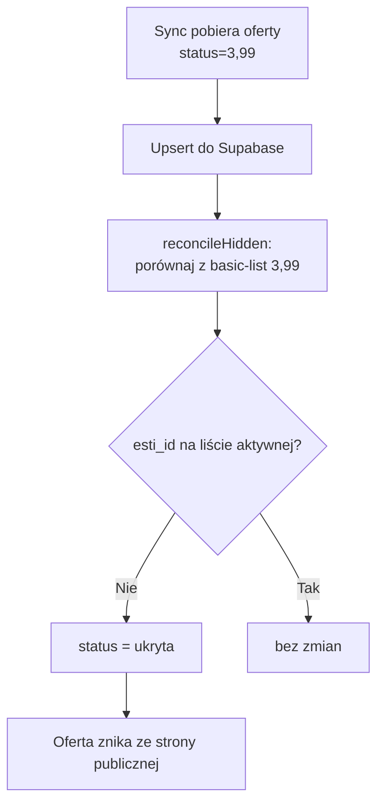
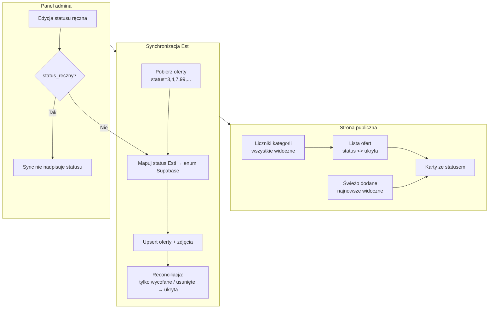

# Plan naprawy widoczności ofert Esti i statusów na stronie

**Data:** 2025-06-25  
**Status:** plan wdrożenia — do realizacji w kodzie i na produkcji  
**Powiązane dokumenty:** `esty_implementation_plan.md`, migracja `20250625000000_esti_integration.sql`

---

## 1. Cel biznesowy (nowe ustalenia)

Dotychczasowy plan (`esty_implementation_plan.md`, sekcja 6.2) zakładał:

> Gdy oferta znika z **aktywnej listy** Esti → ustaw `status = ukryta`.

**Nowe wymaganie (zmiana polityki):**

| Sytuacja w EstiCRM | Oczekiwane zachowanie na stronie |
|---|---|
| Status zmienia się z aktywnej (3) na **sprzedana** (7) | Oferta **pozostaje widoczna**, użytkownik widzi badge „Sprzedana” |
| Status zmienia się na **rezerwacja** (4) | Oferta **pozostaje widoczna**, badge „Rezerwacja” |
| Status zmienia się na **negocjacje wstępne** (kod do weryfikacji w słowniku Esti) | Oferta **pozostaje widoczna** z odpowiednim statusem |
| Status **wycofana** (9) lub oferta **usunięta** z Esti | Oferta **ukryta** na stronie (`status = ukryta`), rekord zostaje w bazie |
| Admin ręcznie zmieni status w panelu | Zmiana **powinna być respektowana** (sync nie nadpisuje bez potrzeby) |

Dodatkowo:

- Oferty z Esti muszą pojawiać się w sekcji **„Świeżo dodane”** na stronie głównej.
- Liczniki kategorii (**„2 mieszkania, 3 działki”**) muszą **wliczać oferty z Esti**.
- Na kartach ofert (lista + strona główna) użytkownik powinien widzieć **aktualny status**, nie tylko na stronie szczegółowej.

---

## 2. Diagnoza — dlaczego to nie działa teraz

### 2.1 Oferty znikają po zmianie statusu w Esti

**Przepływ obecny (problemowy):**



**Przyczyna:** Gdy w Esti status zmienia się np. z `3` (aktywna) na `7` (sprzedana), oferta **wypada z listy** filtrowanej `ESTI_SYNC_STATUS_FILTER=3,99`. Funkcja `reconcileHidden()` w `src/lib/esti/sync.ts` traktuje to jako „zniknięcie z Esti” i ustawia `ukryta`.

**Skutek uboczny:** Ten sam mechanizm powoduje, że:
- oferty Esti **nie wliczają się** do liczników kategorii (`fetchCategoryOfferCounts` filtruje `status <> ukryta`);
- sekcja **„Świeżo dodane”** nie pokazuje ofert Esti (są ukryte, więc nie przechodzą przez `fetchPublicOffers`).

### 2.2 Status widoczny tylko na stronie szczegółowej

- Strona `/oferty/[slug]` **już wyświetla** badge statusu (`STATUS_LABELS`, `STATUS_BADGE_CLASSES`).
- Komponenty `OfferCardCompact` i `OfferCardWide` (`src/components/OfferCard.tsx`) **nie pokazują statusu** — tylko typ nieruchomości, transakcję i ewentualnie badge „Wyróżniona”.
- `toOfferCardData()` w `src/lib/offer-display.ts` nie przekazuje informacji o statusie do kart.

### 2.3 Ręczna edycja statusu w panelu admina

- Formularz `OfferForm.tsx` **ma pole status** i zapis działa (PATCH `/api/admin/offers/[id]`).
- Przy **kolejnej synchronizacji Esti** pole `status` jest **nadpisywane** wartością z mapowania Esti — nie ma go w tablicy `PRESERVED_ON_UPDATE` w `sync.ts`.
- Komunikat w formularzu mówi, że można zmieniać wyróżnienie, ale **nie wspomina o statusie** jako polu chronionym przed sync.

### 2.4 Sekcja „Świeżo dodane”

Logika w `src/components/LatestOffers.tsx`:

1. Najpierw pobiera oferty z `wyrozniona_na_stronie_glownej = true` (limit 6).
2. Jeśli brak wyników → fallback: ostatnie 6 ofert (bez filtra wyróżnienia).

**Problem:** Jeśli istnieją ręczne oferty z flagą wyróżnienia, sekcja **nigdy nie pokaże** ofert Esti (nawet gdy są widoczne). Dodatkowo, gdy oferty Esti są `ukryta` (patrz 2.1), w ogóle nie wchodzą do zapytania publicznego.

### 2.5 Liczniki kategorii na stronie głównej

`fetchCategoryOfferCounts()` w `src/lib/public-offers.ts` liczy rekordy z:
- `status <> 'ukryta'`
- `slug IS NOT NULL`
- dopasowany `typ_nieruchomosci`

Logika jest poprawna — problem leży w danych: oferty Esti mają `status = ukryta` przez błędną reconciliację (patrz 2.1).

---

## 3. Docelowa architektura (po naprawie)



---

## 4. Zmiany w kodzie — szczegółowy opis

### 4.1 Rozszerzenie zakresu synchronizacji statusów

**Plik:** `src/lib/esti/config.ts`, `.env.example`

| Element | Było | Ma być |
|---|---|---|
| `ESTI_SYNC_STATUS_FILTER` (domyślnie) | `3,99` | `3,4,7,99` (+ ewentualnie kody negocjacji po discovery) |
| Komentarz w `.env.example` | tylko aktywne | opis wszystkich synchronizowanych statusów |

**Uzasadnienie:** Sync musi pobierać oferty sprzedane i w rezerwacji, żeby móc zaktualizować ich status zamiast je ukrywać.

**Checklist discovery (przed wdrożeniem na prod):**

- [ ] Wywołać `GET /offer/dictionary` (lub użyć istniejącego `loadEstiDictionary`) i zapisać pełną listę statusów Esti firmy.
- [ ] Zidentyfikować kod statusu **„negocjacje wstępne”** (jeśli występuje).
- [ ] Uzupełnić mapowanie w `mapEstiStatus()` o brakujące kody.

---

### 4.2 Mapowanie statusów Esti → Supabase

**Plik:** `src/lib/esti/map-offer.ts` — funkcja `mapEstiStatus()`

**Obecne mapowanie:**

| Esti | Supabase |
|---|---|
| 3, 99 | `aktywna` |
| 4 | `rezerwacja` |
| 7 | `sprzedana` |
| 9 | `ukryta` |
| inne | `ukryta` ← **problem: zbyt agresywny fallback** |

**Docelowe mapowanie (propozycja — uzupełnić po discovery):**

| Esti | Znaczenie (przykład) | Supabase | Widoczna publicznie? |
|---|---|---|---|
| 3 | Aktywna, publikowana | `aktywna` | tak |
| 99 | Dostępna wewnętrzna | `aktywna` | tak |
| 4 | Rezerwacja | `rezerwacja` | tak |
| 7 | Sprzedana | `sprzedana` | tak |
| ? | Negocjacje wstępne | `rezerwacja` *(lub nowy enum — patrz 4.7)* | tak |
| 9 | Wycofana | `ukryta` | nie |
| nieznany, ale w sync filter | — | log warning + `aktywna` lub osobny status | tak |
| brak w Esti / usunięta | — | `ukryta` (reconciliacja) | nie |

**Ważna zmiana:** Fallback „nieznany status → ukryta” zamienić na bezpieczniejszy wariant (np. `aktywna` + log), **o ile** oferta jest w filtrze sync — inaczej każdy nowy kod statusu w Esti natychmiast chowa ofertę.

---

### 4.3 Przebudowa reconciliacji (`reconcileHidden`)

**Plik:** `src/lib/esti/sync.ts`

**Było:** Ukryj każdą ofertę Esti, której `esti_id` nie ma na liście aktywnej (`basic-list` z filtrem 3,99).

**Ma być:**

1. `fetchActiveBasicList` używa **tego samego** rozszerzonego `statusFilter` co reszta syncu.
2. Oferta jest ukrywana **tylko gdy**:
   - `zrodlo = 'esti'`, **oraz**
   - `esti_id` nie występuje w **żadnej** synchronizowanej liście, **oraz**
   - opcjonalnie: ostatni fetch szczegółów oferty zwraca 404 / status 9.
3. Oferty ze statusem `sprzedana`, `rezerwacja`, `wynajeta` **nie są ukrywane** — tylko aktualizowane.

**Pseudokod:**

```typescript
// reconcileHidden → rename: reconcileRemovedOffers
for (const [estiId, offer] of existing) {
  if (offer.zrodlo !== "esti") continue;
  if (offer.status === "ukryta") continue;
  if (activeEstiIds.has(estiId)) continue; // nadal w sync scope
  // opcjonalnie: fetchOfferDetails(estiId) → jeśli 404 lub status 9 → ukryj
  toHide.push(offer.id);
}
```

**Po naprawie istniejących danych:** Uruchomić **pełny sync** (`mode: full`), który ponownie pobierze oferty z rozszerzonego filtra i przywróci właściwe statusy ukrytym ofertom Esti.

---

### 4.4 Ręczna edycja statusu w panelu admina

**Opcja A (zalecana): flaga `status_reczny` w bazie**

| Element | Opis |
|---|---|
| Migracja SQL | `ALTER TABLE oferty ADD COLUMN status_reczny boolean NOT NULL DEFAULT false;` |
| PATCH admin | Gdy admin zapisuje pole `status` → ustaw `status_reczny = true` |
| Sync | Jeśli `status_reczny = true` → **pomiń** nadpisywanie `status` (dodać do `PRESERVED_ON_UPDATE` lub osobna logika) |
| UI formularza | Checkbox „Status ustawiony ręcznie (nie nadpisuj z Esti)” lub automatyczna flaga przy zmianie statusu |
| Reset flagi | Przycisk w panelu: „Przywróć status z Esti” → `status_reczny = false` + trigger sync |

**Opcja B (prostsza, bez migracji):** Dodać `status` do `PRESERVED_ON_UPDATE` — **niezalecane**, bo status nigdy nie zaktualizuje się z Esti automatycznie.

**Pliki do zmiany (opcja A):**

- `supabase/migrations/YYYYMMDD_status_reczny.sql`
- `src/types/database.ts`
- `src/lib/esti/sync.ts`
- `src/app/api/admin/offers/[id]/route.ts`
- `src/app/panel-admin/OfferForm.tsx`
- `src/app/panel-admin/AdminDashboard.tsx` (badge „status ręczny”)

**Aktualizacja komunikatu w OfferForm** (sekcja Esti):

> Bezpiecznie możesz tu zmieniać: **status**, wyróżnienie oraz dodawać własne zdjęcia. Po ręcznej zmianie statusu sync Esti nie nadpisze go, dopóki nie wybierzesz „Przywróć status z Esti”.

---

### 4.5 Wyświetlanie statusu na kartach ofert

**Pliki:**

| Plik | Zmiana |
|---|---|
| `src/lib/offer-display.ts` | Rozszerzyć `OfferCardData` o `status`, `statusLabel`, `statusBadgeClass` |
| `src/lib/offer-display.ts` | W `toOfferCardData()` mapować z `STATUS_LABELS` / `STATUS_BADGE_CLASSES` |
| `src/components/OfferCard.tsx` | Badge statusu na `OfferCardCompact` i `OfferCardWide` (gdy status ≠ `aktywna`, lub zawsze) |
| `src/lib/offers.ts` | Ewentualnie dodać `STATUS_PUBLIC_BADGE` — czy pokazywać „Aktywna” czy tylko nietypowe statusy |

**Propozycja UX:**

- `aktywna` → brak dodatkowego badge (lub subtelny „Dostępna”)
- `rezerwacja` → badge bursztynowy „Rezerwacja”
- `sprzedana` / `wynajeta` → badge szary „Sprzedana” / „Wynajęta”
- Na liście ofert sprzedane mogą być sortowane niżej (opcjonalnie, faza 2)

---

### 4.6 Sekcja „Świeżo dodane” — nowa logika

**Plik:** `src/components/LatestOffers.tsx`

**Obecna logika (problemowa gdy są wyróżnione ręczne oferty):**

```typescript
const offers = await fetchPublicOffers({ limit: 6, featuredOnHomepage: true });
const fallback = offers.length > 0 ? offers : await fetchPublicOffers({ limit: 6 });
```

**Docelowa logika (propozycja):**

```typescript
// 1. Pobierz ostatnie N widocznych ofert (Esti + ręczne, sort: data_utworzenia DESC)
const latest = await fetchPublicOffers({ limit: 6 });

// 2. Opcjonalnie: wyróżnione na górze, reszta dopełnia do 6
// lub: fetchPublicOffers({ limit: 6 }) bez filtra featured — wystarczy
```

**Alternatywa:** Nowa funkcja `fetchLatestPublicOffers({ limit, preferFeatured?: boolean })` w `public-offers.ts`, która:
1. Bierze wyróżnione na stronie głównej (max 6),
2. Dopełnia brakujące miejsca najnowszymi ofertami (w tym Esti),
3. Bez duplikatów.

**Dodatkowo (opcjonalnie):** Przy **pierwszym imporcie** oferty Esti ustawiać `wyrozniona_na_stronie_glownej = true` przez N dni — raczej **niezalecane**; lepsze jest poprawienie logiki sekcji.

---

### 4.7 Liczniki kategorii

**Plik:** `src/lib/public-offers.ts` — `countPublicOffersByTypes()`

**Zmiana w kodzie:** Brak — po naprawie reconciliacji i statusów oferty Esti automatycznie wejdą do liczenia.

**Weryfikacja po wdrożeniu:**

- [ ] Strona główna → sekcja kategorii pokazuje poprawne liczby (Esti + ręczne).
- [ ] Filtr kategorii na `/oferty?typ=mieszkania` zwraca oferty Esti.

**Opcjonalna decyzja biznesowa:** Czy liczniki mają **wykluczać** `sprzedana` / `wynajeta`? Obecnie wliczają wszystko oprócz `ukryta`. Jeśli sprzedane mają być widoczne na liście, logicznie wliczają się też do licznika.

---

### 4.8 Panel admina — ulepszenia UX statusu

**Plik:** `src/app/panel-admin/AdminDashboard.tsx`

| Zmiana | Opis |
|---|---|
| Zakładka „Aktywne” | Powinna pokazywać też `sprzedana`, `rezerwacja`, `wynajeta` (wszystko oprócz `ukryta`) — **już tak jest** |
| Badge źródła Esti | Już istnieje — bez zmian |
| Badge `status_reczny` | Nowy wskaźnik, gdy status ustawiony ręcznie |
| Filtr statusu (opcjonalnie) | Dropdown: aktywna / rezerwacja / sprzedana / ukryta |

**Plik:** `src/app/panel-admin/OfferForm.tsx`

- Pole status **pozostaje edytowalne** dla ofert Esti.
- Zaktualizować niebieski banner informacyjny (patrz 4.4).

---

## 5. Zmiany w bazie danych

### 5.1 Nowa migracja (zalecana)

```sql
-- supabase/migrations/20250625100000_status_reczny.sql

alter table public.oferty
  add column if not exists status_reczny boolean not null default false;

comment on column public.oferty.status_reczny is
  'Gdy true, synchronizacja Esti nie nadpisuje pola status.';
```

### 5.2 Skrypt naprawczy danych (jednorazowy, po wdrożeniu kodu)

Po deploy i pełnym syncu, opcjonalnie w Supabase SQL Editor:

```sql
-- Podgląd ofert Esti błędnie ukrytych (miały esti_id, są ukryte)
select id, esti_id, tytul, status, data_aktualizacji
from public.oferty
where zrodlo = 'esti' and status = 'ukryta'
order by data_aktualizacji desc;

-- Po pełnym sync z rozszerzonym filtrem statusów rekordy powinny
-- wrócić do właściwego statusu automatycznie.
-- Ręcznie (ostrożnie) tylko jeśli sync nie odzyska oferty:
-- update public.oferty set status = 'sprzedana' where esti_id = '...';
```

---

## 6. Zmienne środowiskowe

**Plik:** `.env.example`, `.env` (Vercel / Netlify)

| Zmienna | Stara wartość | Nowa wartość | Uwagi |
|---|---|---|---|
| `ESTI_SYNC_STATUS_FILTER` | `3,99` | `3,4,7,99` | Dodać kody negocjacji po discovery |
| Pozostałe | bez zmian | — | `ESTI_COMPANY_ID`, `ESTI_API_TOKEN`, `CRON_SECRET` |

---

## 7. Checklista wdrożenia na stronę (krok po kroku)

### Faza 0 — Przygotowanie (lokalnie / staging)

- [ ] **0.1** Uruchomić discovery statusów Esti (`offer/dictionary` lub panel EstiCRM).
- [ ] **0.2** Zapisać kody statusów firmy w tabeli w sekcji 4.2 tego dokumentu.
- [ ] **0.3** Zidentyfikować oferty testowe: jedna aktywna, jedna sprzedana, jedna w rezerwacji w Esti.

### Faza 1 — Kod

- [ ] **1.1** Zaktualizować `DEFAULT_STATUS_FILTER` w `src/lib/esti/config.ts`.
- [ ] **1.2** Uzupełnić `mapEstiStatus()` o brakujące kody + łagodniejszy fallback.
- [ ] **1.3** Przebudować `reconcileHidden()` → ukrywanie tylko wycofanych/usuniętych.
- [ ] **1.4** Dodać migrację `status_reczny` + typy TypeScript.
- [ ] **1.5** Sync: respektować `status_reczny` przy upsercie.
- [ ] **1.6** API admin PATCH: ustawiać `status_reczny = true` przy zmianie statusu.
- [ ] **1.7** Rozszerzyć `OfferCardData` i karty o badge statusu.
- [ ] **1.8** Poprawić logikę `LatestOffers.tsx` (najnowsze widoczne, nie tylko wyróżnione).
- [ ] **1.9** Zaktualizować `.env.example` i komunikat w `OfferForm.tsx`.
- [ ] **1.10** Uruchomić linter / build: `npm run build`.

### Faza 2 — Baza danych (Supabase)

- [ ] **2.1** Zastosować migrację `status_reczny` (`supabase db push` lub SQL Editor).
- [ ] **2.2** Zweryfikować kolumnę: `select status_reczny from oferty limit 1;`

### Faza 3 — Deploy aplikacji

- [ ] **3.1** Wgrać kod na Vercel / Netlify (merge do gałęzi produkcyjnej).
- [ ] **3.2** Ustawić / zaktualizować env: `ESTI_SYNC_STATUS_FILTER=3,4,7,99` (+ negocjacje).
- [ ] **3.3** Upewnić się, że `ESTI_COMPANY_ID`, `ESTI_API_TOKEN`, `CRON_SECRET` są ustawione.

### Faza 4 — Synchronizacja i naprawa danych

- [ ] **4.1** W panelu admina (`/panel-admin`) → **Synchronizuj teraz** → tryb **Pełny (full)**.
- [ ] **4.2** Sprawdzić log sync (`esti_sync_log`): `added`, `updated`, `hidden`, `errors`.
- [ ] **4.3** W panelu admina: oferty Esti ze statusem `sprzedana` / `rezerwacja` **nie są** w zakładce „Ukryte”.
- [ ] **4.4** Jeśli nadal są błędnie ukryte — powtórzyć full sync po weryfikacji filtra statusów.

### Faza 5 — Weryfikacja strony publicznej

- [ ] **5.1** Strona główna → liczniki kategorii (Domy, Mieszkania, Działki, Komercyjne) **zawierają** oferty Esti.
- [ ] **5.2** Sekcja „Świeżo dodane” pokazuje oferty z Esti (najnowsze widoczne).
- [ ] **5.3** `/oferty` — lista zawiera oferty Esti ze **wszystkimi** statusami publicznymi.
- [ ] **5.4** Karty ofert pokazują badge statusu (np. „Sprzedana”, „Rezerwacja”).
- [ ] **5.5** Strona szczegółowa `/oferty/[slug]` — badge statusu zgodny z Esti.
- [ ] **5.6** Zmiana statusu w Esti (test na staging) → po sync status na stronie się **aktualizuje**, oferta **nie znika**.
- [ ] **5.7** Wycofanie oferty w Esti (status 9) → po sync oferta **znika** ze strony publicznej, zostaje w panelu jako ukryta.

### Faza 6 — Panel admina

- [ ] **6.1** Edycja oferty Esti → zmiana statusu → zapis → odświeżenie listy — status się utrzymuje.
- [ ] **6.2** Po sync: ręcznie ustawiony status **nie jest nadpisywany** (flaga `status_reczny`).
- [ ] **6.3** „Przywróć status z Esti” (jeśli zaimplementowane) → sync znów aktualizuje status.
- [ ] **6.4** Wyróżnienie / zdjęcia własne nadal działają jak dotychczas.

### Faza 7 — Produkcja i monitoring

- [ ] **7.1** Cron sync (`/api/cron/sync-esti`) działa co 30–60 min (Vercel cron / Netlify scheduled).
- [ ] **7.2** Po 24h sprawdzić `esti_sync_log` — brak rosnącej liczby błędów.
- [ ] **7.3** Google Search Console — sprawdzić, czy strony sprzedanych ofert nadal indeksują się poprawnie (opcjonalnie `noindex` dla sprzedanych — decyzja SEO, poza zakresem tej naprawy).

---

## 8. Pliki do modyfikacji — podsumowanie

| Plik | Priorytet | Opis zmiany |
|---|---|---|
| `src/lib/esti/config.ts` | **P0** | Rozszerzony domyślny filtr statusów |
| `src/lib/esti/map-offer.ts` | **P0** | Mapowanie statusów + fallback |
| `src/lib/esti/sync.ts` | **P0** | Reconciliacja, `status_reczny`, PRESERVED |
| `src/lib/offer-display.ts` | **P1** | Status na kartach |
| `src/components/OfferCard.tsx` | **P1** | Badge statusu UI |
| `src/components/LatestOffers.tsx` | **P1** | Logika „świeżo dodane” |
| `src/app/panel-admin/OfferForm.tsx` | **P1** | Komunikat + obsługa statusu ręcznego |
| `src/app/api/admin/offers/[id]/route.ts` | **P1** | `status_reczny = true` przy PATCH |
| `src/types/database.ts` | **P1** | Typ `status_reczny` |
| `supabase/migrations/..._status_reczny.sql` | **P1** | Nowa kolumna |
| `.env.example` | **P2** | Dokumentacja filtra statusów |
| `src/app/panel-admin/AdminDashboard.tsx` | **P2** | Badge status ręczny, filtr statusu |
| `src/lib/public-offers.ts` | — | Bez zmian (liczniki naprawią się przez dane) |

---

## 9. Testy regresji (co nie może się zepsuć)

- [ ] Oferty ręczne (`zrodlo = strona`) — sync **nigdy** ich nie modyfikuje.
- [ ] Pola `wyrozniona`, `wyrozniona_na_stronie_glownej` — sync **nie nadpisuje**.
- [ ] Zdjęcia `upload` / `url` — sync **nie usuwa**; zdjęcia `esti` — sync **zastępuje**.
- [ ] Usuwanie oferty z panelu — nadal wymaga potwierdzenia tytułu.
- [ ] RLS publiczny — nadal tylko `status <> ukryta`.
- [ ] Endpoint cron — nadal wymaga `Authorization: Bearer CRON_SECRET`.

---

## 10. Ryzyka i decyzje do potwierdzenia

| Temat | Pytanie | Propozycja |
|---|---|---|
| Negocjacje wstępne | Jaki kod statusu w Esti firmy? | Discovery → mapować na `rezerwacja` |
| Sprzedane na liście | Czy sortować na dół? | Faza 2 — na razie pokazywać z badge |
| SEO sprzedanych | Indeksować strony sprzedanych ofert? | Zostawić jak jest (indeksowane) |
| Liczniki | Czy wliczać sprzedane? | Tak — są widoczne publicznie |
| Nowy enum statusu | Dodać `negocjacje` do `oferta_status`? | Tylko jeśli `rezerwacja` jest mylące — wymaga migracji enum |

---

## 11. Szacowany nakład pracy

| Faza | Czas (orientacyjnie) |
|---|---|
| Discovery statusów Esti | 30 min |
| Kod (P0 + P1) | 3–4 h |
| Migracja + deploy + full sync | 1 h |
| Testy manualne (checklisty 5–7) | 1–2 h |
| **Razem** | **~1 dzień roboczy** |

---

## 12. Definicja „gotowe” (acceptance criteria)

Naprawa uznana za zakończoną, gdy:

1. Oferta zmieniona w Esti z aktywnej na sprzedaną / rezerwację **pozostaje na stronie** z poprawnym statusem.
2. Użytkownik widzi status na **karcie oferty** i na **stronie szczegółowej**.
3. Admin może **ręcznie edytować status**; sync go **nie nadpisuje** bez zgody (flaga `status_reczny`).
4. Sekcja **„Świeżo dodane”** pokazuje oferty Esti.
5. **Liczniki kategorii** na stronie głównej wliczają oferty Esti.
6. Tylko oferty **wycofane / usunięte** z Esti stają się `ukryta`.

---

*Dokument utworzony na podstawie analizy kodu w repozytorium `pawel-development` oraz zgłoszonych problemów widoczności ofert Esti.*
